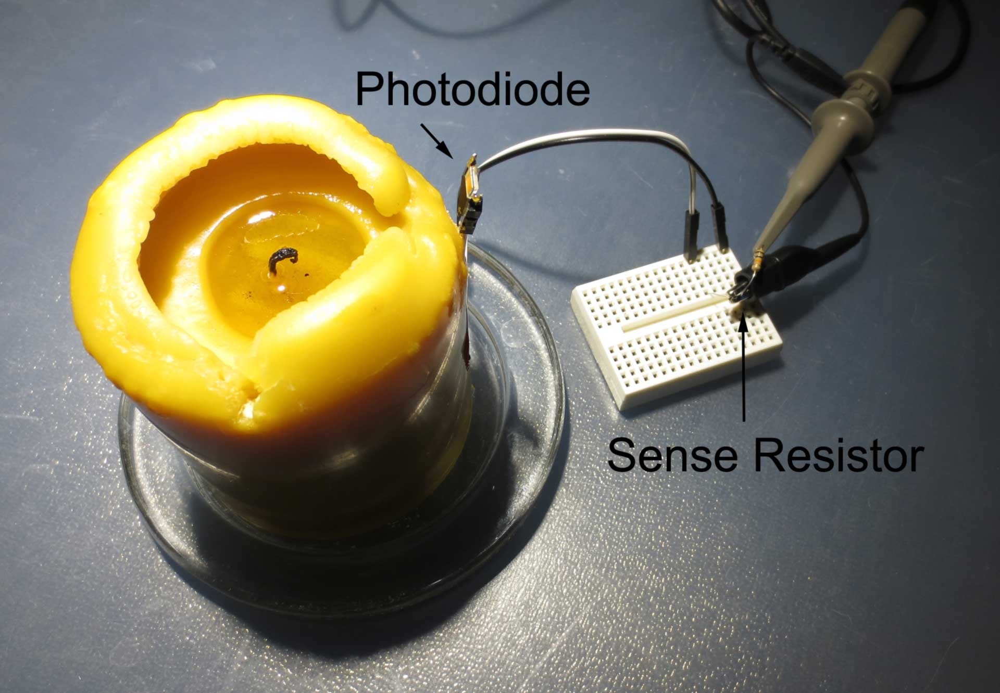

"Reverse Engineering" a real candle
=============

Analysis of the flicker pattern of a real candle.

See [“Reverse engineering” a real candle](https://cpldcpu.wordpress.com/2016/01/05/reverse-engineering-a-real-candle/)

* Analysis: Raw data traces and Matlab scripts to generate plots
* Images: Photos and diagrams

